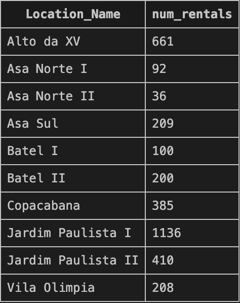
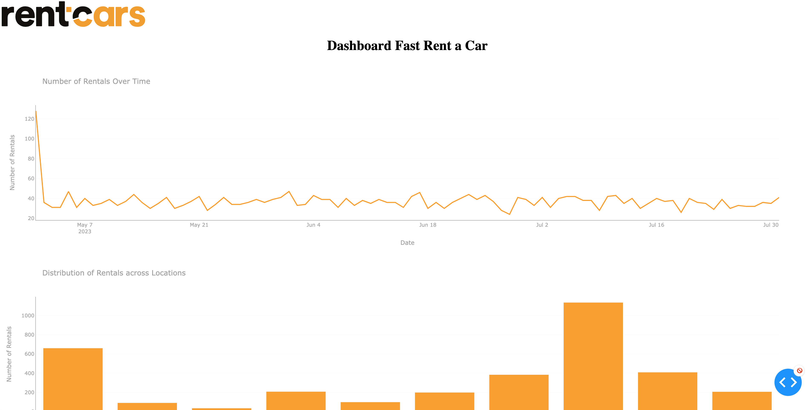
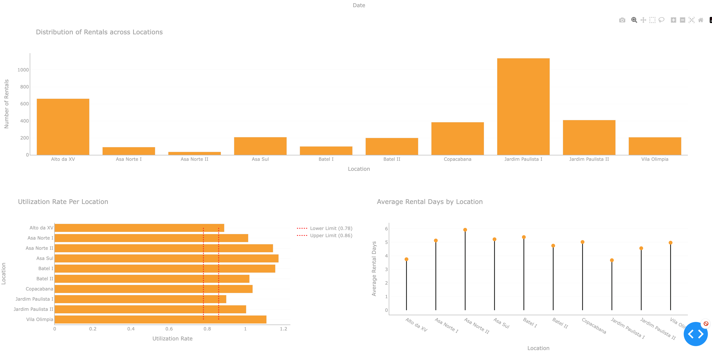

# Rent-a-Car Analysis

## Description
This repository contains an analysis of a car rental business. The scripts and notebooks housed here provide a comprehensive view of the operation, encompassing demand patterns, fleet utilization rate, and average rental durations per location.

## Prerequisites

- [Python 3.11](https://www.python.org/downloads/) or later
- [Docker](https://www.docker.com/get-started) (for packaging dependencies and local testing)
- [Make](https://www.gnu.org/software/make/) Needed to run the Makefile commands. This is standard on Unix-based systems but can be installed on Windows using a package manager like [Chocolatey](https://chocolatey.org/).


## Project Structure

```
.
├── Case-Study.pdf
├── Dockerfile
├── LICENSE
├── Makefile
├── README.md
├── config.ini
├── pyproject.toml
├── requirements.txt
├── docker
├── docker-compose.yml
├── data
│   ├── Locations.csv
│   ├── Vehicle_Rentals.csv
│   └── fast_rent_a_car.db
├── logs
│   └── application.log
├── sql
│   ├── aux
│   ├── avg_rental_days_per_location.sql
│   ├── create_locations_table.sql
│   ├── create_vehicles_table.sql
│   ├── rentals_over_time.sql
│   ├── rentals_per_location.sql
│   └── utilization_rate_per_location.sql
└── src
    ├── __init__.py
    ├── app.py
    ├── data_cleaning.py
    ├── data_ingestion.py
    ├── data_quality_checks.ipynb
    ├── database.py
    ├── fleet_utilization_rate.ipynb
    └── main.py
```


- `src/`: Main Python scripts for etl, analysis and visualization.
- `sql/`: Contains SQL queries used for report generation.
- `data/`: Directory containing the SQLite database with rental data.
- `logs/`: Directory to store logs generated during execution.
- `requirements.txt`: List of Python dependencies.
- `Makefile`: Utility script to simplify common commands like linting and running tests.
config.ini: Project-related configurations.
- `Dockerfile`: File to build the Docker image for this project.
- `docker-compose.yml`: Docker Compose configuration to start the necessary services.


## Setup & Installation

1. **Clone the repository**:

```bash
git clone git@github.com:ricardomattos05/rent-a-car.git
cd rent-a-car
```

2. **Python Environment Setup**:
Run `make init` to create a virtual environment, install the required Python packages, and set up pre-commit hooks.

3. **Docker Setup**:
Build the Docker image:
```bash
make docker-build
```

## Linting
To apply linters to your code, run the following command:

```bash
make lint
```

## How to Run

Once you've setup all the environment, you can reproduce all the ETL pipeline and run the Dash application.

1. **ETL**

All scripts and notebooks are in the src/ directory and can be run individually to delve into different facets of the dataset. To run the ETL and create de database, you can run the command:

```
make docker-etl
```

2. **Visualization**

Start the dashboard by accessing this [url](http://rentcardash.duckdns.org:8050/) or executing src/app.py and access via your browser at the specified address with the command:

```
make docker-app
```

## Analyses Conducted

The business logic and questions raised can be found in the [pdf](https://github.com/ricardomattos05/rent-a-car/blob/main/Case-Study.pdf).


#### 1. Load the datasets into a database (for the sake of the test, SQLite database can be used):

- You can find the fast_rent_a_car.db in the [data/](https://github.com/ricardomattos05/rent-a-car/tree/main/data) folder, as well as the raw .csv files. to reproduce the pipeline, refer to section [How to Run](#how-to-run)

#### 2. Inspect the data for any quality issues (missing data, incorrect data, outliers, etc.), perform necessary cleaning using Python.

- Check [src/data_quality_checks.ipynb](https://github.com/ricardomattos05/rent-a-car/blob/main/src/data_quality_checks.ipynb) for the quality checks performed. The quality treatments implemented based on this can be found in the file [src/data_cleaning.py](https://github.com/ricardomattos05/rent-a-car/blob/main/src/data_cleaning.py).

#### 3. Using SQL, generate a report that shows the number of rentals per location.

- The query can be checked in the file [sql/rentals_per_location.sql](https://github.com/ricardomattos05/rent-a-car/blob/main/sql/rentals_per_location.sql). The output is:

<p align="left">
  
</p>


#### 4. Using Python, determine the utilization rate of the fleet per location.

- The code to generate the utilization rate of the fleet per location can be found in [src/fleet_utilization_rate.ipynb](https://github.com/ricardomattos05/rent-a-car/blob/main/src/fleet_utilization_rate.ipynb).

#### 5. Using a data visualization tool of your choice (e.g., Matplotlib, Seaborn, Tableau), create a dashboard that shows

- The code to generate the dash can be found in the file [src/app.py](https://github.com/ricardomattos05/rent-a-car/blob/main/src/app.py). To run the app reference to [How to Run](#how-to-run). If you just want to check it out, you can access the public [url](http://rentcardash.duckdns.org:8050/) available.

<p align="left">
  
</p>

<p align="left">
  
</p>

#### 6. Based on your analysis, identify any locations that have a car surplus or shortage and answer the questions below:

##### a. What are the busiest and slowest locations in terms of vehicle rentals?

##### b. Based on the current utilization of vehicles, do any locations frequently run out
of cars or have an excess?

##### c. What data-driven recommendations would you make to ensure an efficient
distribution of cars across all locations?

These questions will be answer below in the Conclusions.

## Conclusions

### Busiest and Least Busy Locations in Terms of Vehicle Rentals

**Busiest**: Jardim Paulista I with 1136 rentals.
**Least Busy**: Asa Norte II with 36 rentals.

###  Vehicle Shortage or Excess

**Locations possibly running out of cars**: Those with utilization rates greater than 1, such as `Asa Norte I`, `Asa Norte II`, `Asa Sul`, `Batel I`, `Copacabana`, `Jardim Paulista II`, and `Vila Olimpia`.
**Locations that needs more fleet**: `Jardim Paulista I` and `Alto da XV`.

All Locations exceeded the utilization rate of 86%.

### Data-Driven Recommendations for Efficient Car Distribution

Based on the data analysis provided and considering the utilization rate as the key metric to ascertain the optimal fleet size, here are our data-driven recommendations to ensure an efficient distribution of cars across all locations:

1. **Asa Norte I & II and Batel Fleet Management:**
    - Both Asa Norte locations and Batel demonstrate high average rental days and high utilization rates, yet low rental volumes. One hypothesis is that these regions have a **limited fleet**. This constraint could be leading to the observed low volume of rentals: a limited number of cars can only be rented out to a limited number of customers, especially if those rentals are for longer durations.
    - While a limited fleet seems a plausible reason, it's crucial to note that several other factors could also be influencing these observations. These include geographical or cultural characteristics, customer preference for specific car models, local competitive pressures, or regional marketing campaigns. Comprehensive further analysis and perhaps customer surveys would be required to validate this hypothesis and rule out other contributing factors.

2. **Rebalance Fleet for 'Jardim Paulista I':**
    - Given its utilization rate of 90%, it's running just above the efficient threshold. Consider increasing the fleet slightly to prevent potential shortages during peak demand times.

3. **Expand Fleet for 'Asa Norte I', 'Asa Norte II', 'Asa Sul', 'Batel I', 'Copacabana', and 'Vila Olimpia':**
    - These locations consistently run with utilization rates higher than 86%. Expanding the fleet can help meet customer demand more effectively.

4. **Monitor 'Alto da XV':**
    - With a utilization rate of 88.9%, it's close to the upper efficiency threshold. Regular monitoring can ensure that it remains within the desired range.

5. **Investigate Low Rentals in 'Asa Norte II':**
    - Despite having one of the highest utilization rates, it also has a very low number of rentals. This could indicate that the fleet size is very small, and any rental significantly impacts the utilization rate. Consider a review of fleet size against actual demand.
